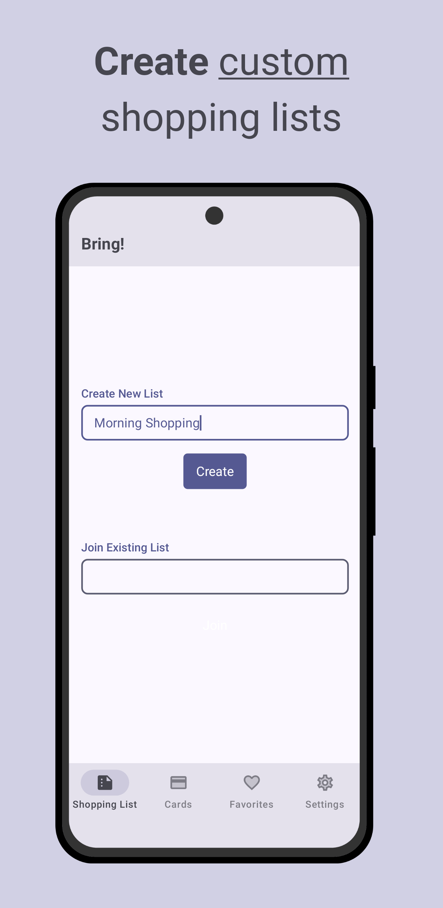
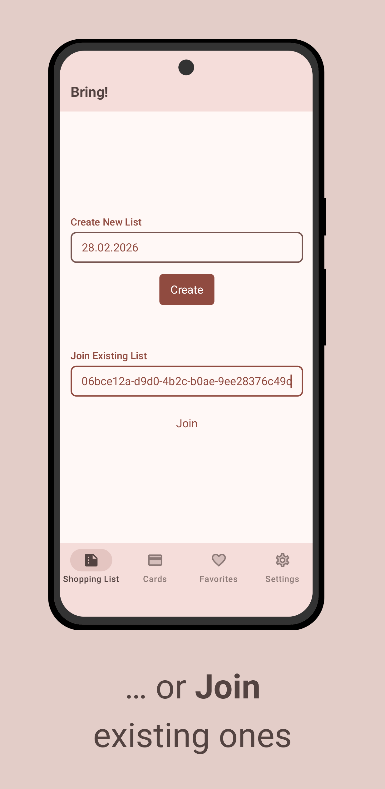
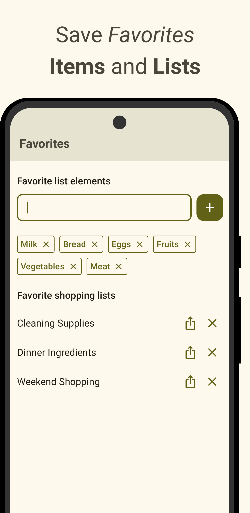
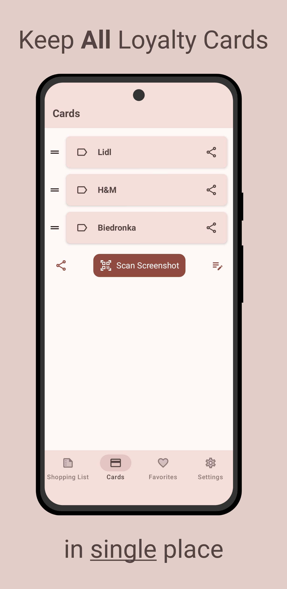
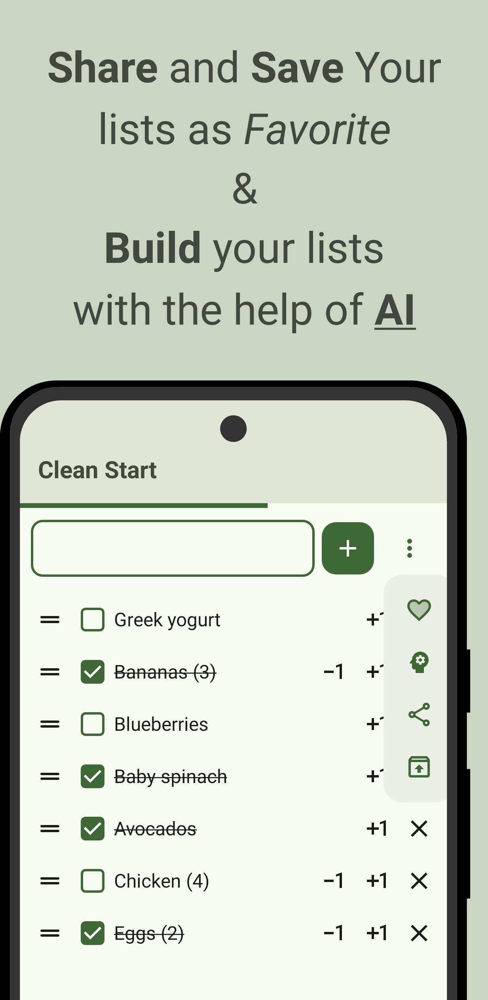
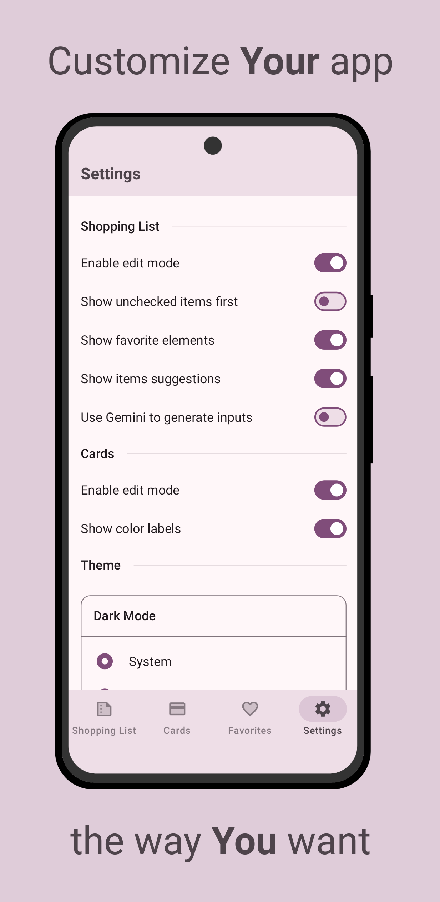

# 🛒 Bring! - A Multiplatform Shopping List App

[](https://bring.procyk.in)
[](https://github.com/avan1235/bring/releases/latest)
[](https://github.com/avan1235/bring/releases/latest)

[](https://github.com/avan1235/bring/actions/workflows/client.yml)
[](https://github.com/avan1235/bring/releases/latest)
[](https://play.google.com/store/apps/details?id=in.procyk.bring)
[](https://hub.docker.com/repository/docker/avan1235/bring/tags?ordering=last_updated)

[](./LICENSE.md)
[](https://github.com/avan1235/bring/stargazers)
[](https://github.com/avan1235/bring/fork)

## 📱 Overview

Bring! is a modern, feature-rich shopping list application built with Kotlin Multiplatform (KMP) and Compose Multiplatform (CMP). It allows users to create, manage, and share shopping lists across multiple platforms with a seamless, native-like experience.

Web version is publicly available at https://bring.procyk.in.

If you like the project, consider supporting it by leaving ⭐.

<div style="display: flex; justify-content: center; flex-wrap: nowrap;">
  
  
  
</div>
<div style="display: flex; justify-content: center; flex-wrap: nowrap;">
  
  
  
</div>


## 🚀 Features

- ✅ Create and manage shopping lists
- ✅ Import shopping lists data from external websites
- ✅ Generate shopping lists with the help of AI
- ✅ Mark items as favorites for quick access
- ✅ Real-time synchronization across devices
- ✅ Customizable settings
- ✅ Beautiful, responsive UI

## 🛠️ Technology Stack

### Client
- **Kotlin Multiplatform** - Share code across platforms
- **Compose Multiplatform** - UI framework for all platforms
- **Ktor Client** - HTTP client for API communication
- **KStore** - Cross-platform storage solution
- **Arrow** - Functional programming library
- **Kotlinx Serialization** - JSON/CBOR serialization
- **Kotlinx Coroutines** - Asynchronous programming
- **Kotlinx DateTime** - Cross-platform date/time handling
- **Kotlinx RPC** - Type-safe client-server communication

### Server
- **Ktor Server** - Asynchronous web framework
- **Exposed** - SQL framework for database access
- **PostgreSQL** - Relational database
- **GraalVM** - Native compilation for improved performance
- **Koin** - Dependency injection
- **Kotlinx RPC** - Type-safe client-server communication

## 💻 Supported Platforms

The client application supports:
- 📱 Android <a href="https://play.google.com/store/apps/details?id=in.procyk.bring"></a>
- 🍎 iOS (requires macOS for building)
- 🖥️ Desktop (Windows, macOS, Linux via JVM)
- 🌐 Web (via WebAssembly and JavaScript)

## 🏗️ Project Structure

```
bring
├─ composeApp           # Client application code
│  └─ src
│     ├─ androidMain    # Android-specific code
│     ├─ commonMain     # Shared client code
│     ├─ iosMain        # iOS-specific code
│     ├─ jvmMain        # Desktop-specific code
│     └─ webMain        # Web-specific code
├─ server               # Server application code
│  └─ src
│     ├─ main           # Server implementation
│     └─ test           # Server integration tests
├─ shared               # Shared code between client and server
│  └─ src
│     └─ commonMain     # Data models, API definitions
└─ shared-client        # Client-specific shared code
   └─ src
      ├─ commonMain     # API clients, network communication
      └─ ...            # Platform-specific code
```

## 🚀 Getting Started

### Prerequisites
- JDK 21 or higher
- Docker and Docker Compose (for running the server)
- Android Studio or IntelliJ IDEA (for development)
- Xcode (for iOS development, macOS only)

## 📄 License
This project is licensed under the MIT License - see the LICENSE file for details.

## 👨‍💻 Author
Maciej Procyk