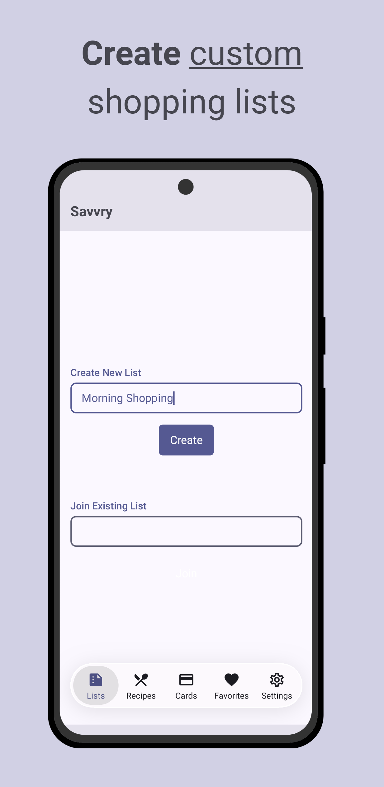
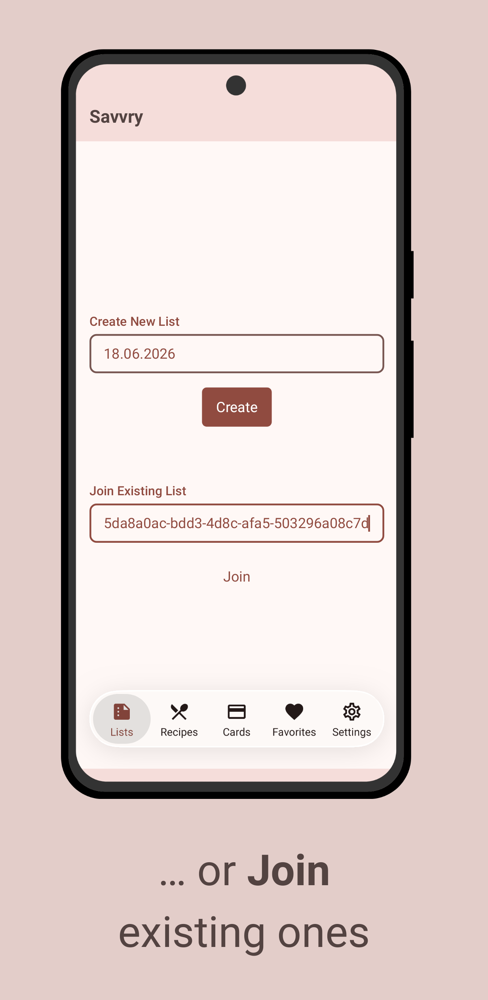
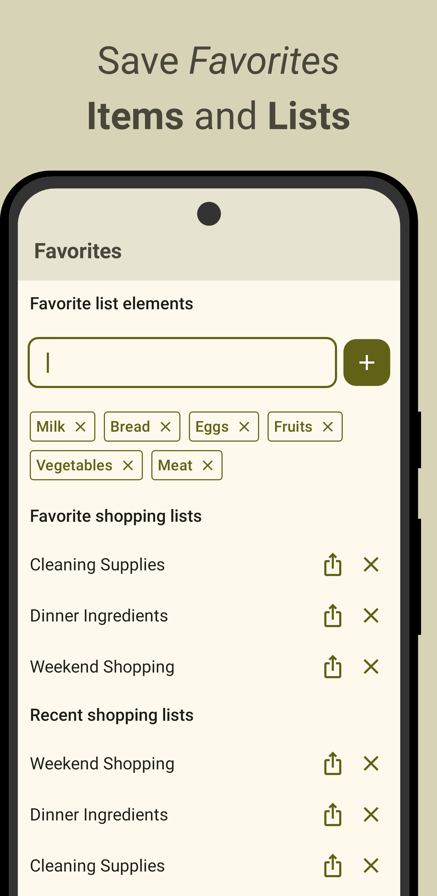
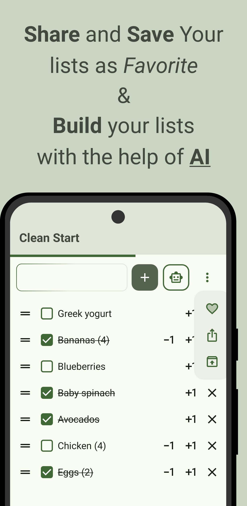
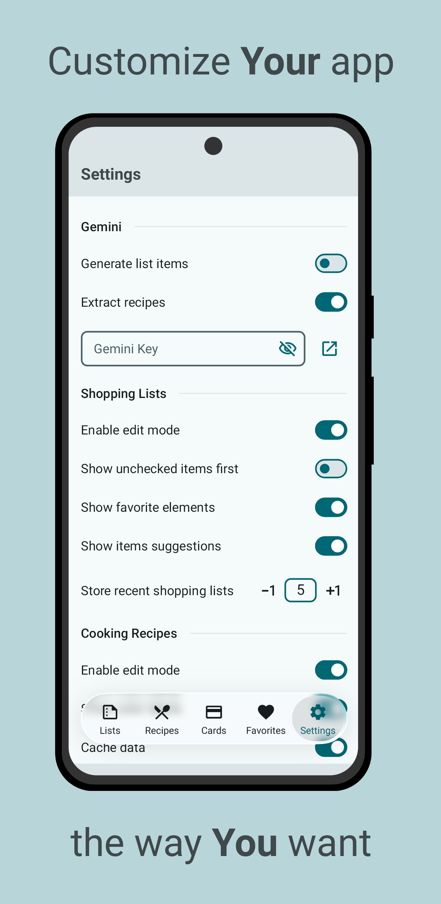
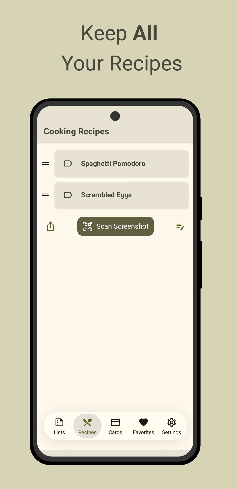
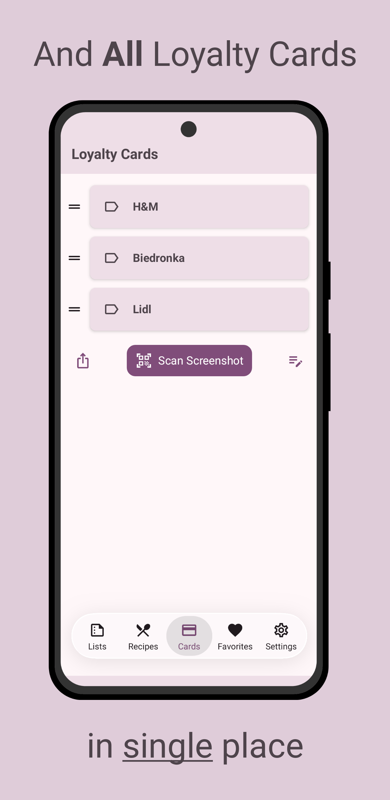
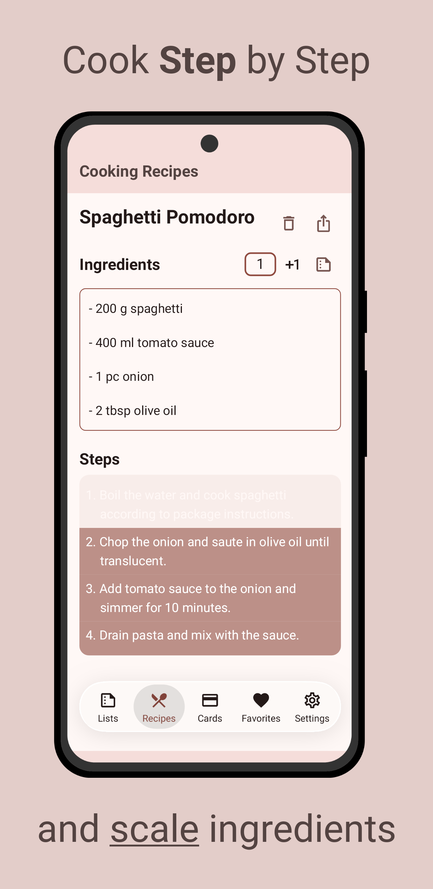

# 🛒 Savvry - A Multiplatform Shopping List App

[](https://savvry.procyk.in)
[](https://github.com/avan1235/savvry/releases/latest)
[](https://github.com/avan1235/savvry/releases/latest)

[](https://github.com/avan1235/savvry/actions/workflows/client.yml)
[](https://github.com/avan1235/savvry/releases/latest)
[](https://play.google.com/store/apps/details?id=in.procyk.savvry)
[](https://hub.docker.com/repository/docker/avan1235/savvry/tags?ordering=last_updated)

[](./LICENSE.md)
[](https://github.com/avan1235/savvry/stargazers)
[](https://github.com/avan1235/savvry/fork)

## 📱 Overview

<div style="display: flex; justify-content: center; flex-wrap: nowrap;">
  
</div>

Savvry is a modern, feature-rich shopping list application built with Kotlin Multiplatform (KMP) and Compose Multiplatform (CMP). It allows users to create, manage, and share shopping lists across multiple platforms with a seamless, native-like experience.

Web version is publicly available at https://savvry.procyk.in.

If you like the project, consider supporting it by leaving ⭐.

<div style="display: flex; justify-content: center; flex-wrap: nowrap;">
  
  
  
</div>
<div style="display: flex; justify-content: center; flex-wrap: nowrap;">
  
  
</div>
<div style="display: flex; justify-content: center; flex-wrap: nowrap;">
  
  
  
</div>


## 🚀 Features

- ✅ **Create & Manage Shopping Lists**: Intuitively organize your purchases with features like list sharing, favoriting items for quick access, and drag-and-drop reordering.
- ✅ **AI-Powered List Generation & Recipe Extraction**: Generate curated shopping lists from plain-text descriptions or extract recipes and ingredients automatically from text and images using Gemini-powered AI agents (**Koog**).
- ✅ **Website Recipe Import**: Seamlessly scrape and extract ingredients from external cooking and recipe sites (including *Kwestia Smaku*, *Cookidoo*, *Ania Gotuje*, and other general platforms) via server-side scraping (**Ksoup**).
- ✅ **Loyalty Card Wallet**: Scan, extract, decode, and store all of your loyalty cards in one place with server-side QR and barcode decoding support (**ZXing**, **PNGJ**, **JpegDecoder**).
- ✅ **Real-Time Synchronization**: Instantly sync data across all active client devices using type-safe client-server communication powered by **Kotlinx RPC** and **Ktor**.
- ✅ **Beautiful & Highly Customizable UI**: Fully responsive interface built on modern components (**Lumo Composables**), featuring dynamic Material 3 theme generation (**MaterialKolor** & **ColorPicker**), custom shapes, and automatic dark-mode support.
- ✅ **Offline-First Storage**: Secure local-first database/file storage capability with platform-specific engines, ensuring the app remains fully functional offline (**KStore**).

## 🛠️ Technology Stack

### Client
- **Kotlin Multiplatform (KMP)** - Core business logic, networking, and data storage shared seamlessly across Android, iOS, Desktop, and Web.
- **Compose Multiplatform (CMP)** - Shared declarative UI framework offering high-performance, fully native rendering on all target platforms.
- **Ktor Client** - For asynchronous multiplatform HTTP networking and real-time WebSocket communication.
- **KStore** - Local key-value and file storage utilizing CIO engines on native platforms and local storage on Web.
- **Kotlinx RPC** - Modern type-safe client-server communication utilizing CBOR serialization for ultra-fast synchronization.
- **Koog Agents & Google Prompt-Executor** - Custom prompt-engineering and LLM agent integration framework for structured data extraction and AI features.
- **Lumo Composables** - Modern component and design system library tailored for Compose Multiplatform.
- **MaterialKolor & Colorpicker** - Dynamic Material 3 theme and color palette generation.
- **FileKit** - Cross-platform, modern file picker and directory chooser for importing/exporting files.
- **Reorderable** - Smooth drag-and-drop list and element reordering inside Compose.
- **Arrow Core & Arrow Serialization** - Functional programming utilities (such as `Either`) and serialization support.
- **Kotlinx Serialization, Coroutines, & DateTime** - Type-safe JSON/CBOR serialization, structured concurrency, and multiplatform date/time handling.

### Server
- **Ktor Server** - Asynchronous web framework engine written in Kotlin.
- **GraalVM Native Image** - Compiles the Kotlin server code into a standalone, extremely fast, and lightweight native executable.
- **Exposed SQL ORM** - Type-safe Kotlin framework for relational database access.
- **PostgreSQL** - Production-ready relational database with PostgreSQL JDBC Driver support (`pgjdbc-ng`).
- **Ksoup** - Multiplatform HTML parser for web scraping and external ingredient/recipe extraction.
- **ZXing, PNGJ, & JpegDecoder** - Server-side high-fidelity QR/Barcode parsing and image decoding.
- **Koin** - Dependency injection framework (integrated into the Ktor server).
- **Kotlinx RPC Server** - Type-safe RPC handler paired with Ktor server.
- **Arrow Core & Serialization** - Functional programming patterns on the server.
- **Kotlinx Datetime & Serialization** - Shared models compatibility.
- **Testcontainers** - Multi-platform Docker containers helper for running database integration tests in JVM.

## 💻 Supported Platforms

The client application supports:
- 📱 **Android**: Target SDK 35, Compile SDK 37. Powered by Compose Multiplatform UI. <a href="https://play.google.com/store/apps/details?id=in.procyk.savvry"></a>
- 🍎 **iOS**: Fully native UI framework using Compose Multiplatform (requires macOS/Xcode for building).
- 🖥️ **Desktop**: Cross-platform JVM application targeting Windows, macOS, and Linux.
- 🌐 **Web**: Modern, high-performance Web application compiled via **WebAssembly (WasmJS)** and JavaScript.

## 🏗️ Project Structure

```
savvry
├─ app                     # Client application code
│  ├─ shared               # Shared client UI & business logic (Compose Multiplatform)
│  │  └─ src
│  │     ├─ commonMain     # Main shared Compose UI, ViewModels, and client logic
│  │     ├─ androidMain    # Android resources and Compose UI previews
│  │     ├─ iosMain        # iOS-specific framework implementations
│  │     ├─ jvmMain        # Desktop-specific implementation details
│  │     └─ wasmJsMain     # WebAssembly (WasmJS) implementation details
│  ├─ androidApp           # Android launcher module (targetSdk 35, compileSdk 37)
│  ├─ desktopApp           # Desktop JVM launcher module
│  ├─ iosApp               # iOS native Xcode project (SwiftUI entry point)
│  └─ webApp              # WebAssembly (WasmJS) launcher module and index assets
├─ server                  # Server application module (Ktor Server with GraalVM Native Support)
│  └─ src
│     ├─ main              # Server implementation (routes, databases, scrapers, barcode decoders)
│     └─ test              # Integration & unit tests (JUnit 5 with Testcontainers)
├─ core                    # Shared data models, validation logic, and serialization protocols
├─ rpc-client              # Client RPC proxy module using Kotlinx RPC & Ktor Client
└─ build-src               # Gradle convention plugins for environment setup
```

## 🚀 Getting Started

### Prerequisites
- **JDK 21** or higher
- **Docker and Docker Compose** (for running the server and database)
- **Android Studio** or **IntelliJ IDEA** (for client and server development)
- **Xcode** (for iOS development, macOS only)

### Development Commands

We provide a convenient `Makefile` to simplify common development tasks:

#### Running the Database & Server
1. **Start PostgreSQL Database**:
   ```bash
   make db
   ```
2. **Start Ktor Server (using Docker)**:
   ```bash
   make server
   ```
3. **Start Ktor Server (locally)**:
   ```bash
   make server-local
   ```

#### Running the Clients
1. **Run Desktop App (JVM)**:
   ```bash
   make desktop
   ```
2. **Run Web App (WebAssembly)**:
   ```bash
   make wasm
   ```
3. **Run Android App**:
   Open the project in Android Studio and run `:app:androidApp`.
4. **Run iOS App**:
   Open the Xcode workspace inside `app/iosApp` on macOS and run.

#### Quality Assurance & Screenshot Testing
1. **Run Host Screenshot Tests**:
   ```bash
   make screenshots
   ```
   *This uses **Roborazzi** to capture and test shared Compose UI components on a host machine.*

#### Cleanup
1. **Clean build artifacts & Docker environments**:
   ```bash
   make clean
   ```

## 📄 License
This project is licensed under the MIT License - see the LICENSE file for details.

## 👨‍💻 Author
Maciej Procyk